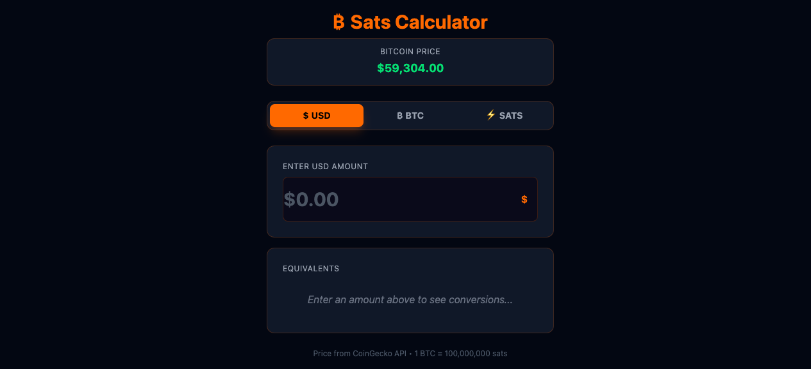

# Dylan Whitlock | Portfolio

A modern, responsive portfolio website showcasing my experience as a Senior Software Engineer & AI Specialist.

[](https://opensource.org/licenses/MIT)


## 🚀 Live Demo

Visit the live site: [dylanwebv3.netlify.app](https://dylanwebv3.netlify.app)

## 📸 Preview



## ✨ Features

- **Modern Dark Theme** - Sleek, professional design with blue accent gradients
- **Responsive Layout** - Optimized for all screen sizes
- **Smooth Animations** - Scroll-triggered reveals and hover effects
- **AI Experience Section** - Showcasing Prompt Engineering, Claude, GPT, and local models
- **Netlify Contact Form** - Form submissions handled by Netlify Forms
- **SEO Optimized** - Meta tags and semantic HTML

## 🛠️ Tech Stack

- **Framework:** React 19
- **Build Tool:** Vite
- **Styling:** Tailwind CSS v4
- **Animations:** Framer Motion
- **Icons:** Lucide React
- **Deployment:** Netlify

## 📋 Sections

- **Hero** - Introduction with name, title, and call-to-action
- **About** - Bio with key statistics (8+ years experience, 4 certs, 10+ projects)
- **Experience** - Work history (Litify, GM Financial, Fenway Group)
- **Skills** - Technical skills with proficiency levels
  - AI & Machine Learning (Prompt Engineering, Claude, GPT, Local Models)
  - Salesforce Platform
  - Web Technologies
  - Development Tools
  - Cloud & Platforms
  - Methodologies
- **Education & Certifications** - Degree and professional certifications
- **Projects** - Featured repositories and projects
- **Contact** - Contact form and social links

## 🏗️ Getting Started

### Prerequisites

- Node.js 18+
- npm or yarn

### Installation

```bash
# Clone the repository
git clone https://github.com/matt-dylan/dylanwebv3.git

# Navigate to project directory
cd dylanwebv3

# Install dependencies
npm install

# Start development server
npm run dev
```

### Build for Production

```bash
npm run build
```

### Preview Production Build

```bash
npm run preview
```

## 📄 License

This project is licensed under the MIT License - see the [LICENSE](LICENSE) file for details.

## 👤 About

**Dylan Whitlock**
- Senior Software Engineer & AI Specialist
- Based in Carthage, TX
- Salesforce Architect with 8+ years of experience
- Passionate about AI integration and enterprise solutions

### Connect

- [GitHub](https://github.com/matt-dylan)
- [LinkedIn](https://www.linkedin.com/in/dylan-whitlock-49973a114)
- [Trailblazer Profile](https://trailblazer.me/id/dwhitlock)
- [Email](mailto:matthew.whitlock8@gmail.com)

## 🙏 Acknowledgments

- Built with React, Vite, and Tailwind CSS
- Icons from Lucide React
- Fonts: Inter and JetBrains Mono
